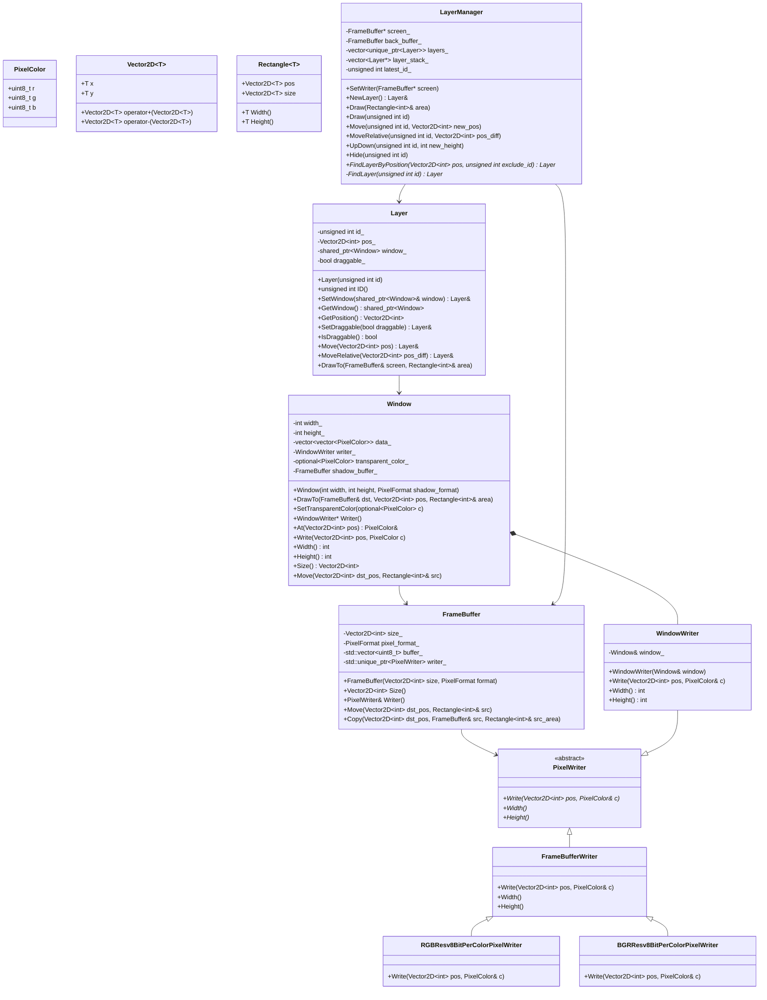
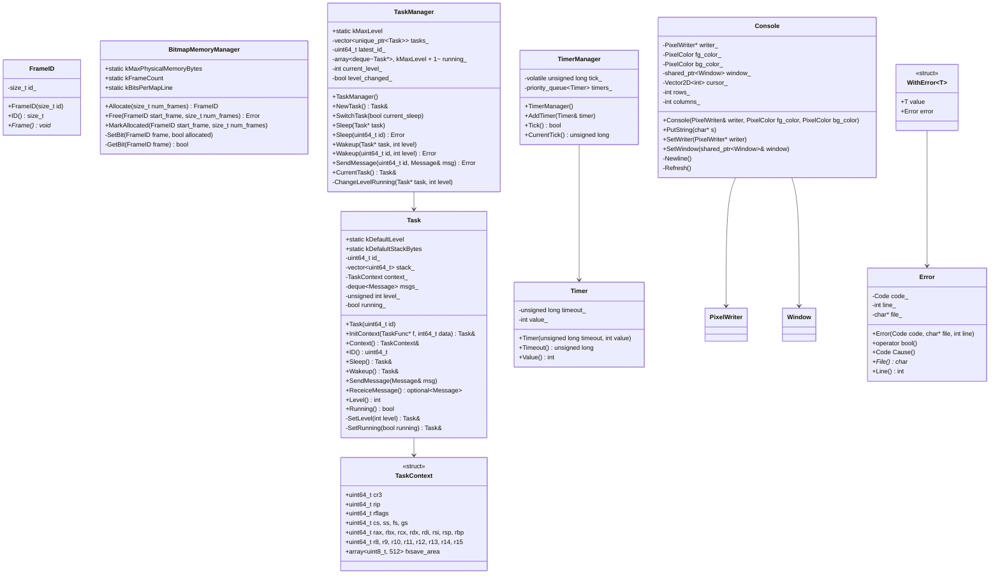

# MikanOS Class Diagram

## Overview
This document contains UML class diagrams for the MikanOS project classes implemented in `./my_mikanos`.

## Core System Classes



## System Management Classes



## Message System and Hardware

```mermaid
classDiagram
    %% Message System
    enum LayerOperation {
        Move
        MoveRelative
        Draw
    }
    
    class Message {
        <<struct>>
        +enum Type type
        +uint64_t src_task
        +union arg
    }
    
    class Mouse {
        +Mouse(unsigned int layer_id)
        +SetPosition(Vector2D~int~ position)
        +OnInterrupt(uint8_t buttons, int8_t displacement_x, int8_t displacement_y)
        -unsigned int layer_id_
        -Vector2D~int~ position_
        -unsigned int drag_layer_id_
        -Vector2D~int~ previous_drag_pos_
    }
    
    Message --> LayerOperation
    
    %% PCI System
    namespace pci {
        class ClassCode {
            <<struct>>
            +uint8_t base
            +uint8_t sub
            +uint8_t interface
            +Match(uint8_t b) bool
            +Match(uint8_t b, uint8_t s) bool
            +Match(uint8_t b, uint8_t s, uint8_t i) bool
        }
        
        class Device {
            <<struct>>
            +uint8_t bus
            +uint8_t device
            +uint8_t function
            +uint8_t header_type
            +ClassCode class_code
        }
        
        class MSICapability {
            <<struct>>
            +union header
            +uint32_t msg_addr
            +uint32_t msg_upper_addr
            +uint32_t msg_data
            +uint32_t mask_bits
            +uint32_t pending_bits
        }
        
        Device --> ClassCode
    }
    
    %% Interrupt System
    class InterruptDescriptor {
        <<struct>>
        +uint16_t offset_low
        +uint16_t segment_selector
        +uint16_t attr
        +uint16_t offset_middle
        +uint32_t offset_high
        +uint32_t reserved
    }
    
    class InterruptVector {
        +enum Number
    }
    
    class InterruptFrame {
        <<struct>>
        +uint64_t rip
        +uint64_t cs
        +uint64_t rflags
        +uint64_t rsp
        +uint64_t ss
    }
```

## USB System Classes

```mermaid
classDiagram
    %% USB Base Classes
    namespace usb {
        class Device {
            <<abstract>>
            +~Device()
            +ControlIn(EndpointID ep_id, SetupData setup_data, void* buf, int len, ClassDriver* issuer)* Error
            +ControlOut(EndpointID ep_id, SetupData setup_data, void* buf, int len, ClassDriver* issuer)* Error
            +InterruptIn(EndpointID ep_id, void* buf, int len)* Error
            +InterruptOut(EndpointID ep_id, void* buf, int len)* Error
            +StartInitialize() Error
            +IsInitialized() bool
            +EndpointConfigs() EndpointConfig*
            +NumEndpointConfigs() int
            +OnEndpointsConfigured() Error
            +Buffer() uint8_t*
            #OnControlCompleted(EndpointID ep_id, SetupData setup_data, void* buf, int len) Error
            #OnInterruptCompleted(EndpointID ep_id, void* buf, int len) Error
            -array~ClassDriver*, 16~ class_drivers_
            -array~uint8_t, 256~ buf_
        }
        
        class ClassDriver {
            <<abstract>>
            +ClassDriver(Device* dev)
            +~ClassDriver()
            +Initialize()* Error
            +SetEndpoint(EndpointConfig& config)* Error
            +OnEndpointsConfigured()* Error
            +OnControlCompleted(EndpointID ep_id, SetupData setup_data, void* buf, int len)* Error
            +OnInterruptCompleted(EndpointID ep_id, void* buf, int len)* Error
            +ParentDevice() Device*
            #Device* dev_
        }
        
        class HIDBaseDriver {
            +HIDBaseDriver(Device* dev, int interface_index)
            +~HIDBaseDriver()
            +Initialize() Error
            +SetEndpoint(EndpointConfig& config) Error
            +OnEndpointsConfigured() Error
            +OnControlCompleted(EndpointID ep_id, SetupData setup_data, void* buf, int len) Error
            +OnInterruptCompleted(EndpointID ep_id, void* buf, int len) Error
            #static kBufferSize
            #int interface_index_
            #EndpointID ep_interrupt_in_
            #EndpointID ep_interrupt_out_
            #bool initialize_phase_
            #array~uint8_t, kBufferSize~ buf_
            #array~uint8_t, kBufferSize~ previous_buf_
        }
        
        class HIDMouseDriver {
            +HIDMouseDriver(Device* dev, int interface_index)
            +OnInterruptCompleted(EndpointID ep_id, void* buf, int len) Error
            -int8_t displacement_x_
            -int8_t displacement_y_
            -uint8_t previous_buttons_
        }
        
        class HIDKeyboardDriver {
            +HIDKeyboardDriver(Device* dev, int interface_index)
            +OnInterruptCompleted(EndpointID ep_id, void* buf, int len) Error
        }
        
        Device --> ClassDriver
        ClassDriver <|-- HIDBaseDriver
        HIDBaseDriver <|-- HIDMouseDriver
        HIDBaseDriver <|-- HIDKeyboardDriver
        
        %% USB Descriptors
        class DeviceDescriptor {
            <<struct>>
            +uint8_t length
            +uint8_t descriptor_type
            +uint16_t usb_release
            +uint8_t device_class
            +uint8_t device_sub_class
            +uint8_t device_protocol
            +uint8_t max_packet_size
            +uint16_t vendor_id
            +uint16_t product_id
            +uint16_t device_release
            +uint8_t manufacturer
            +uint8_t product
            +uint8_t serial_number
            +uint8_t num_configurations
        }
        
        class ConfigurationDescriptor {
            <<struct>>
            +uint8_t length
            +uint8_t descriptor_type
            +uint16_t total_length
            +uint8_t num_interfaces
            +uint8_t configuration_value
            +uint8_t configuration_id
            +uint8_t attributes
            +uint8_t max_power
        }
        
        class InterfaceDescriptor {
            <<struct>>
            +uint8_t length
            +uint8_t descriptor_type
            +uint8_t interface_number
            +uint8_t alternate_setting
            +uint8_t num_endpoints
            +uint8_t interface_class
            +uint8_t interface_sub_class
            +uint8_t interface_protocol
            +uint8_t interface_id
        }
        
        class EndpointDescriptor {
            <<struct>>
            +uint8_t length
            +uint8_t descriptor_type
            +uint8_t endpoint_address
            +uint8_t attributes
            +uint16_t max_packet_size
            +uint8_t interval
        }
        
        class HIDDescriptor {
            <<struct>>
            +uint8_t length
            +uint8_t descriptor_type
            +uint16_t hid_release
            +uint8_t country_code
            +uint8_t num_descriptors
            +ClassDescriptor* GetClassDescriptor(size_t index)
        }
        
        class ClassDescriptor {
            <<struct>>
            +uint8_t descriptor_type
            +uint16_t descriptor_length
        }
        
        HIDDescriptor --> ClassDescriptor
    }
```

## System Initialization and Configuration

```mermaid
classDiagram
    %% Memory Map Structures
    class MemoryMap {
        <<struct>>
        +unsigned long long buffer_size
        +void* buffer
        +unsigned long long map_size
        +unsigned long long map_key
        +unsigned long long descriptor_size
        +uint32_t descriptor_version
    }
    
    class MemoryDescriptor {
        <<struct>>
        +uint32_t type
        +uintptr_t physical_start
        +uintptr_t virtual_start
        +uint64_t number_of_pages
        +uint64_t attribute
    }
    
    enum MemoryType {
        kEfiReservedMemoryType
        kEfiLoaderCode
        kEfiLoaderData
        kEfiBootServicesCode
        kEfiBootServicesData
        kEfiRuntimeServicesCode
        kEfiRuntimeServicesData
        kEfiConventionalMemory
        kEfiUnusableMemory
        kEfiACPIreclaimMemory
        kEfiACPMemoryNVS
        kEfiMemoryMappedIO
        kEfiMemoryMappedIOPortSpace
        kEfiPalCode
        kEfiPersitentMemory
        kEfiMaxMemoryType
    }
    
    MemoryMap --> MemoryDescriptor
    MemoryDescriptor --> MemoryType
    
    %% Frame Buffer Configuration
    class FrameBufferConfig {
        <<struct>>
        +uint8_t* frame_buffer
        +uint32_t pixels_per_scan_line
        +uint32_t horizontal_resolution
        +uint32_t vertical_resolution
        +PixelFormat pixel_format
    }
    
    %% ACPI System
    namespace acpi {
        class RSDP {
            <<struct>>
            +char signature[8]
            +uint8_t checksum
            +char oem_id[6]
            +uint8_t revision
            +uint32_t rsdt_address
            +uint32_t length
            +uint64_t xsdt_address
            +uint8_t extended_checksum
            +char reserved[3]
        }
        
        class DescriptionHeader {
            <<struct>>
            +char signature[4]
            +uint32_t length
            +uint8_t revision
            +uint8_t checksum
            +char oem_id[6]
            +char oem_table_id[8]
            +uint32_t oem_revision
            +uint32_t creator_id
            +uint32_t creator_revision
        }
        
        class XSDT {
            <<struct>>
            +DescriptionHeader header
            +uint64_t entries[]
        }
        
        class FADT {
            <<struct>>
            +DescriptionHeader header
            +char reserved1[76 - sizeof(header)]
            +uint32_t pm_tmr_blk
            +char reserved2[112 - 80]
            +uint32_t flags
            +char reserved3[276 - 116]
        }
        
        XSDT --> DescriptionHeader
        FADT --> DescriptionHeader
    }
```

This UML class diagram shows the complete class structure of the MikanOS project, organized into logical groups:

1. **Core System Classes**: Graphics, window management, and layer system
2. **System Management Classes**: Memory, task, timer, console, and error handling
3. **Message System and Hardware**: Message passing, mouse handling, PCI devices, and interrupts
4. **USB System Classes**: USB device management, class drivers, and descriptors
5. **System Initialization and Configuration**: Memory mapping, frame buffer, and ACPI structures

The diagrams show the inheritance relationships, composition relationships, and the overall architecture of the MikanOS system.